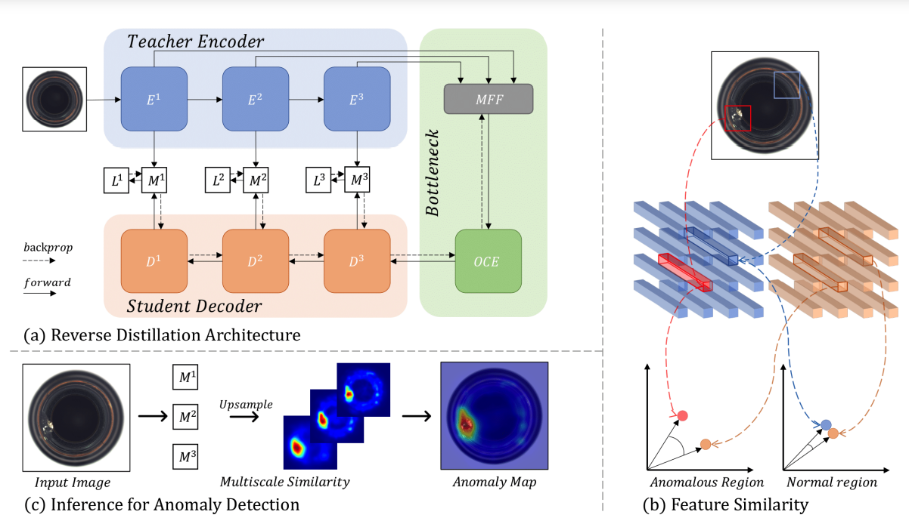
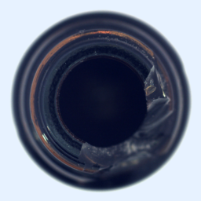
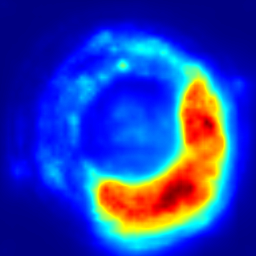
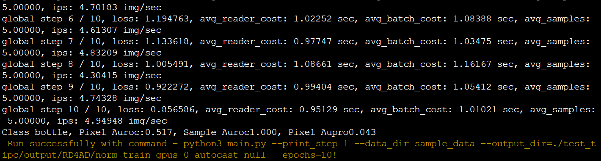
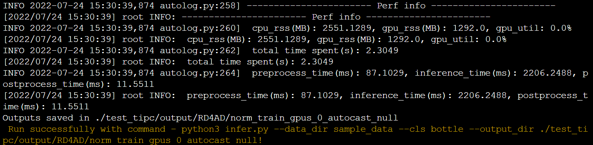

# Anomaly Detection via Reverse Distillation from One-Class Embedding

## 目录

- [1. 简介]()
- [2. 数据集和复现精度]()
- [3. 准备数据与环境]()
    - [3.1 准备环境]()
    - [3.2 准备数据]()
    - [3.3 准备模型]()
- [4. 开始使用]()
    - [4.1 模型训练]()
    - [4.2 模型评估]()
    - [4.3 模型预测]()
- [5. 模型推理部署]()
- [6. 自动化测试脚本]()
- [7. LICENSE]()
- [8. 参考链接与文献]()

## 1. 简介

在异常检测领域传统的知识蒸馏的存在一个问题：容易阻碍异常表现的多样性
- 传统的知识蒸馏teacher和student的网络架构很相似或者几乎相同 
- 而且teacher和student的输入流都是一样的  

针对上面提出的问题，作者提出了一个反转的知识蒸馏方案，将teacher作为encoder，student作为decoder,并且在teacher和student之间加入了一个one-class bottleneck embedding (OCBE) 模块。在OCBE模块中，包含了多尺度特征融合模块MFF和一类特征提取模块OCE，使用多尺度融合大多数理由都差不多：低维度的特征包含了很多纹理、边缘等信息，高维度的特征包含了很多语义结构等信息。然后多尺度融合其实也进行了一个压缩特征的作用，去掉冗余的信息





**论文:** [Anomaly Detection via Reverse Distillation from One-Class Embedding](https://arxiv.org/pdf/2201.10703v2.pdf)

**参考repo:** [RD4AD](https://github.com/hq-deng/RD4AD)

在此非常感谢 RD4AD repo的Yikai-Wang等人贡献的[RD4AD](https://github.com/hq-deng/RD4AD) ，提高了本repo复现论文的效率。


## 2. 数据集和复现精度
**数据集:** [下载](https://aistudio.baidu.com/aistudio/datasetdetail/116256)

**复现精度:**

| RD4AD | Pixel Auroc | Pixel Aupro | Sample Auroc |
|-------|-------------|-------------|--------------|
| 论文    | 97.8        | 93.9        | 98.5         |
| 复现    | 97.9        | 94.4        | 98.9         |

权重和日志[下载](https://pan.baidu.com/s/1Jm7T7mXG24Dl1F93e39jqg?pwd=66ef)
## 3. 准备数据与环境


### 3.1 准备环境

首先介绍下支持的硬件和框架版本等环境的要求，格式如下：

- 硬件：GPU: Tesla V100 Mem 32GB, CPU 2cores RAM 16GB (aistudio高级GPU)
- 框架：
  - paddlepaddle-gpu==2.3.1
- 使用如下命令安装依赖：

```bash
pip install -r requirements.txt
## 安装AutoLog（规范化日志输出工具）
pip install  https://paddleocr.bj.bcebos.com/libs/auto_log-1.2.0-py3-none-any.whl
```

### 3.2 准备数据

数据解压到mvtec目录下，少量测试数据sample_data已包含在本repo

```
# 全量数据： mvtec
# 少量数据： sample_data
```

## 4. 开始使用

### 4.1 模型训练
#### 复现论文精度
```bash
python main.py
```
```
global step 1400 / 1600, loss: 0.129398, avg_reader_cost: 3.65117 sec, avg_batch_cost: 3.69953 sec, avg_samples: 15.46000, ips: 4.17891 img/sec
Class wood, Pixel Auroc:0.957, Sample Auroc0.990, Pixel Aupro0.914
global step 1450 / 1600, loss: 0.131336, avg_reader_cost: 3.70710 sec, avg_batch_cost: 3.75891 sec, avg_samples: 15.46000, ips: 4.11289 img/sec
global step 1500 / 1600, loss: 0.123535, avg_reader_cost: 3.81175 sec, avg_batch_cost: 3.86202 sec, avg_samples: 15.46000, ips: 4.00308 img/sec
global step 1550 / 1600, loss: 0.122679, avg_reader_cost: 4.09909 sec, avg_batch_cost: 4.14866 sec, avg_samples: 15.46000, ips: 3.72651 img/sec
global step 1600 / 1600, loss: 0.125247, avg_reader_cost: 4.32358 sec, avg_batch_cost: 4.37478 sec, avg_samples: 15.28000, ips: 3.49275 img/sec
Class wood, Pixel Auroc:0.956, Sample Auroc0.992, Pixel Aupro0.916
```


### 4.2 模型评估
评估训练好的模型
```bash
python main.py --mode eval
```
评估结果
```
Class grid, Pixel Auroc:0.993, Sample Auroc1.000, Pixel Aupro0.976
Class pill, Pixel Auroc:0.983, Sample Auroc0.974, Pixel Aupro0.969
Class transistor, Pixel Auroc:0.922, Sample Auroc0.975, Pixel Aupro0.787
Class metal_nut, Pixel Auroc:0.974, Sample Auroc1.000, Pixel Aupro0.925
Class screw, Pixel Auroc:0.996, Sample Auroc0.988, Pixel Aupro0.98
Class toothbrush, Pixel Auroc:0.991, Sample Auroc0.981, Pixel Aupro0.941
Class zipper, Pixel Auroc:0.986, Sample Auroc0.986, Pixel Aupro0.964
Class tile, Pixel Auroc:0.956, Sample Auroc0.996, Pixel Aupro0.908
Class wood, Pixel Auroc:0.954, Sample Auroc0.993, Pixel Aupro0.927
Pixel Auroc:0.979, Sample Auroc0.989, Pixel Aupro0.944
```

### 4.3 模型预测
单张图片检测，并与ground truth对比  


```bash
python main.py --mode infer --data_dir sample_data --cls bottle
```
## 5. 模型推理部署
###  模型导出
```bash
python export_model.py
```
### 静态图推理
单张图片检测，并与ground truth对比
```bash
python infer.py --data_dir sample_data --cls bottle
```

## 6. 自动化测试脚本

```shell
bash test_tipc/test_train_inference_python.sh test_tipc/configs/train_infer_python.txt  lite_train_lite_infer
```
关键步骤展示  
  

## 7. LICENSE

本项目的发布受[MIT License](./LICENSE)许可认证。

## 8. 参考链接与文献

[1] [Anomaly Detection via Reverse Distillation from One-Class Embedding](https://arxiv.org/pdf/2201.10703v2.pdf)

[2] [RD4AD](https://github.com/hq-deng/RD4AD)
