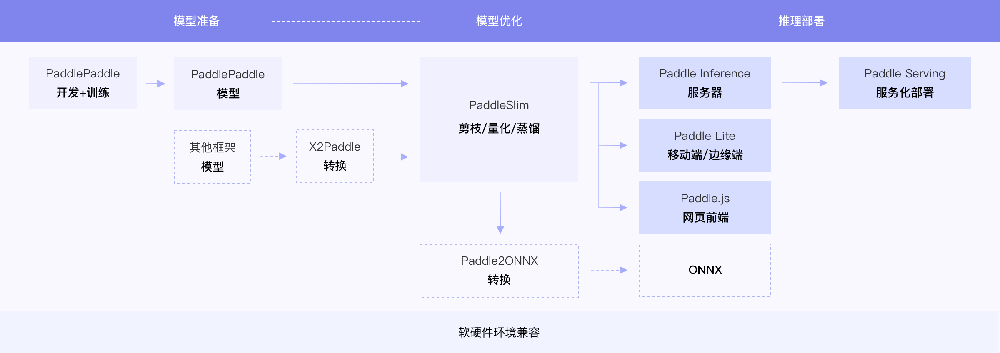

# 飞桨训推一体认证

## 1. 简介

飞桨除了基本的模型训练和预测，还提供了支持多端多平台的高性能推理部署工具。本文档提供了PaddleClas中所有模型的飞桨训推一体认证 (Training and Inference Pipeline Certification(TIPC)) 信息和测试工具，方便用户查阅每种模型的训练推理部署打通情况，并可以进行一键测试。

<div align="center">
    
</div>

## 2. 汇总信息


**字段说明：**
- 基础训练预测：包括模型训练、Paddle Inference Python预测。

| 算法论文 | 模型名称 | 模型类型 | 基础<br>训练预测 |
| :--- | :--- |  :----:  | :--------: |
| ICI-FSL     |ICI-FSL | 小样本学习  | 支持 | 

## 3. 测试工具简介
### 目录介绍
```
./test_tipc/
├── common_func.sh                     #test_*.sh会调用到的公共函数
├── config     # 配置文件目录
│   ├── train_infer_python.txt        
├── docs
│   ├── guide.png
├── README.md                           # 使用文档
└── test_train_inference_python.sh      # 测试python训练预测的主程序
```

### 测试流程概述

测试基本训练预测功能的`lite_train_lite_infer`模式，运行：

```shell
# 运行测试
bash test_tipc/test_train_inference_python.sh ./test_tipc/configs/train_infer_python.txt 'lite_train_lite_infer'
```

